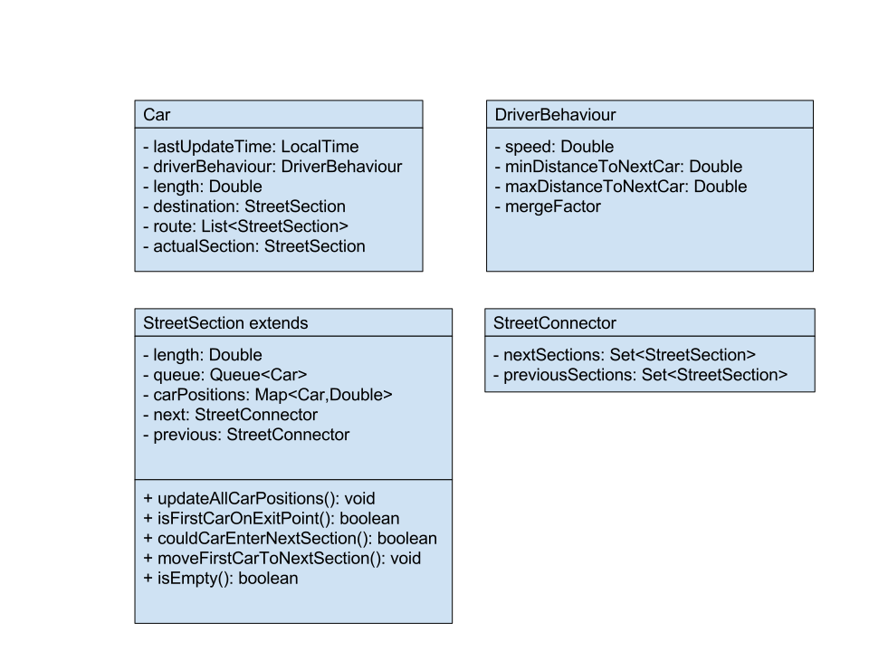
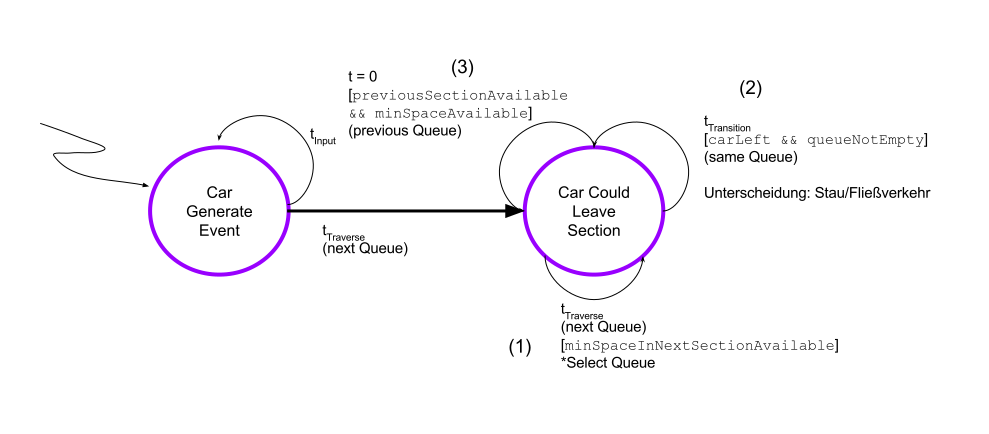

# Roundabout Simulation Library
Build status: 

Consists of 2 sub modules:
- Roundabout API
- Roundabout Core

## Usage

## Entities

## Event Diagram

## Branching
We use feature branches and create pull requests for merging into master branch. Merging only after review.
