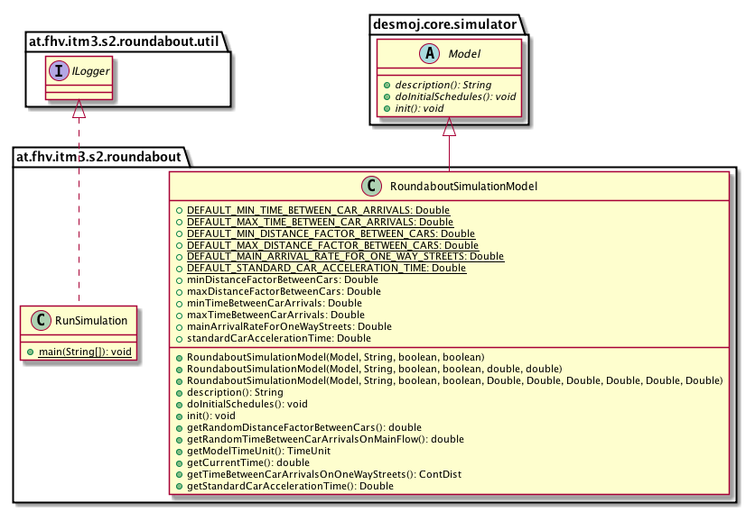
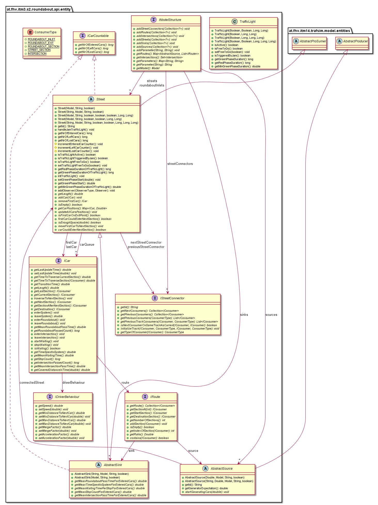
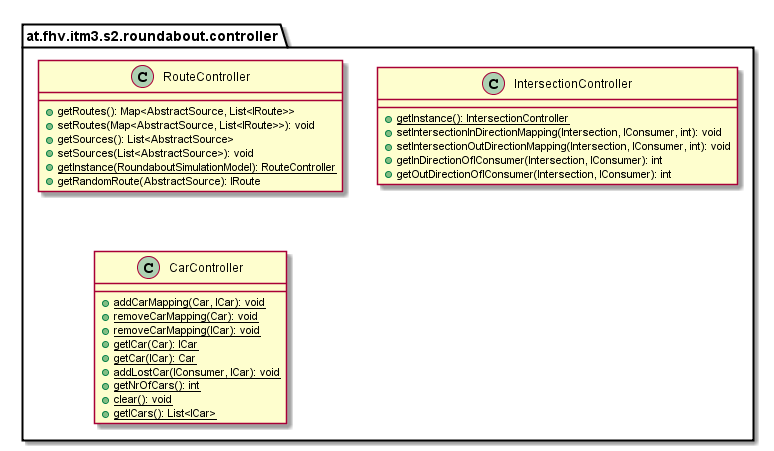
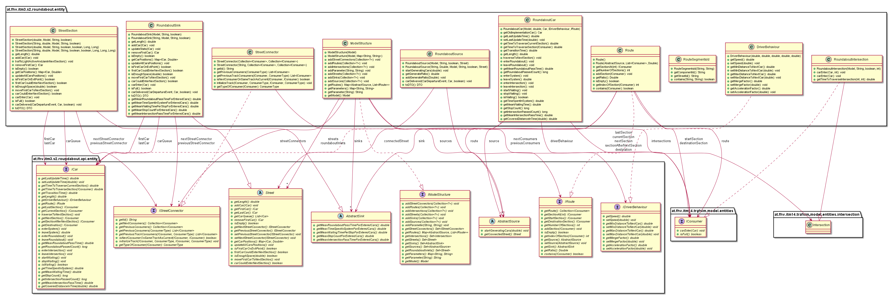
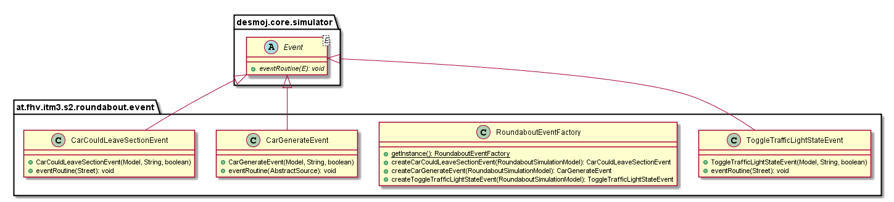
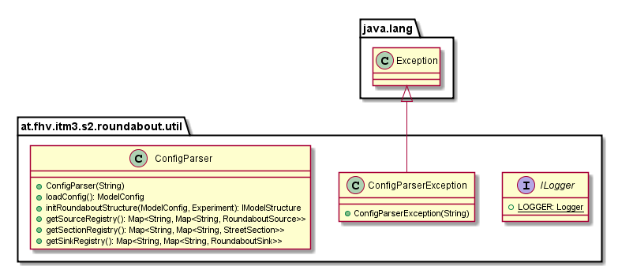

# UML Class Diagram

## at.fhv.itm3.s2.roundabout

## at.fhv.itm3.s2.roundabout.api.entity

## at.fhv.itm3.s2.roundabout.controller

## at.fhv.itm3.s2.roundabout.entity

## at.fhv.itm3.s2.roundabout.event

## at.fhv.itm3.s2.roundabout.util

